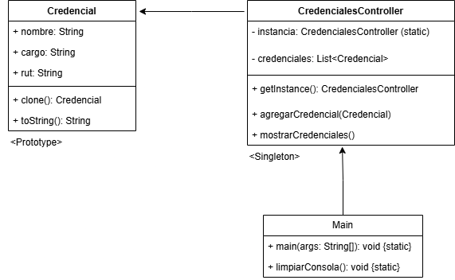

# Trabajo-obligatorio-Generador-de-Credenciales-de-Evento
Dilan Abarca
# Sistema de Emisión de Credenciales Personalizadas

Este proyecto implementa un sistema en Java para generar credenciales personalizadas a partir de una plantilla base, utilizando los patrones de diseño **Prototype** y **Singleton**. La aplicación incluye un menú interactivo por consola que permite al usuario agregar y visualizar credenciales.

---

## 🔧 Tecnologías usadas

- Java 
- Netbeans
---

## 🧠 Patrones de diseño aplicados

### 🧬 Prototype

El patrón Prototype se implementa en la clase `Credencial`, permitiendo crear nuevas credenciales mediante clonación de una plantilla base.

- La clase `Credencial` implementa `Cloneable` y sobrescribe el método `clone()`.
- Cada credencial se personaliza luego de clonar la plantilla.

### 🔒 Singleton

El patrón Singleton se aplica en la clase `CredencialesController`, encargada de gestionar la lista de credenciales.

- Contiene un constructor privado.
- Se accede mediante el método estático `getInstance()`.
- Asegura que solo exista una instancia del controlador.

---
## Diagrama UML

## 🔄 Cómo ejecutar el programa
1. Descargar `Generador de Credenciales de Evento.rar`.
2. Descomprimir archivo rar.
3. Abre NetBeans.
4. Ve a `Archivo > Abrir proyecto` y selecciona la carpeta del proyecto.
5. Cargamos el proyecto.
6. Selecciona `Ejecutar`.
